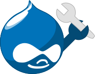

# Drupal Dev Tools  


An electron js app for downloading files uploaded through a production Drupal service and download the production database.
This helps with the local development process and syncing in github. 


## Install
```
npm install
```

## Running
```
npm start
```

## Packaging
Running htese packaging scripts will out put into a release-builds sub-folder.

**Mac OS package**
```
npm run package-mac
```

**Windows package**
```
npm run package-win
```

**Linux package**
```
npm run package-linux
```

## Settings
To run in with development tools set the process.env.NODE_ENV equal to 'dev' in index.js.
Before packaging set to 'production'. To open development tools use CMD+I.

```
process.env.NODE_ENV = 'dev';
process.env.NODE_ENV = 'production';
```

A **.dsphp** file is save to local disk. These are the settings for Drupals settings.php file.
```
{
  "host":"IP or Host Name",
  "port":"Port",
  "username":"root",
  "password":"root",
  "database":"databaseName",
  "baseURL":"LocalHost Address",
  "lhPort":"LocalHost Port"
}
```